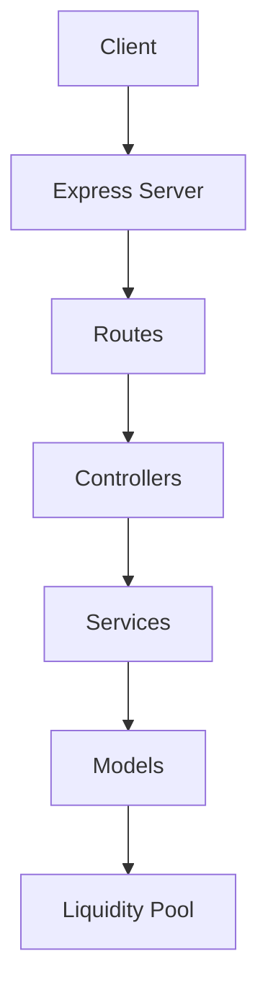
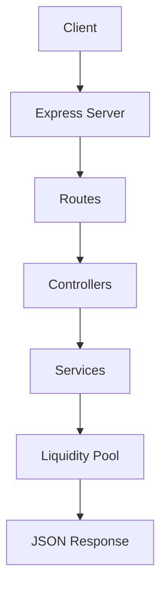

# MiniSwap AMM

<p align="center">
  
  
  
  
</p>

<p align="center">
  <strong>A decentralized exchange simulator inspired by Uniswap.</strong><br />
  MiniSwap AMM is a polished learning project for automated market maker pricing, liquidity management, and REST API design.
</p>

<p align="center">
  
  
  
</p>

---

## Table of Contents

- [Project Overview](#project-overview)
- [Repository Structure](#repository-structure)
- [Features](#features)
- [Architecture](#architecture)
- [Request Flow](#request-flow)
- [Backend Documentation](#backend-documentation)
- [Constant Product Formula](#constant-product-formula)
- [Tech Stack](#tech-stack)
- [Getting Started](#getting-started)
- [Running the Project](#running-the-project)
- [API Reference](#api-reference)
- [Example Requests](#example-requests)
- [Example Responses](#example-responses)
- [Future Improvements](#future-improvements)
- [Contributing](#contributing)
- [License](#license)
- [Footer](#footer)

---

## Project Overview

MiniSwap AMM is a decentralized exchange simulator designed to demonstrate how an automated market maker works in practice.

The repository is organized as a small full-stack workspace with:

- a Node.js + Express backend
- a frontend workspace placeholder for future UI work
- a shared project structure suitable for iterative expansion

The backend currently supports:

- health checks
- buy quotes
- buy asset execution
- sell asset execution
- add liquidity
- remove liquidity

<details>
<summary><strong>What this project is useful for</strong></summary>

MiniSwap AMM is ideal for:

- learning constant product AMM mechanics
- experimenting with liquidity pool state transitions
- prototyping DEX-style APIs
- demonstrating layered backend architecture
- serving as a base for a future trading UI

</details>

---

## Repository Structure

```text
miniswap-amm/
├── backend/
│   ├── package.json
│   ├── server.js
│   ├── test.js
│   └── src/
│       ├── app.js
│       ├── controllers/
│       ├── models/
│       ├── routes/
│       └── services/
├── frontend/
└── README.md
```

---

## Features

- ✅ REST health endpoint
- ✅ Quote endpoint for AMM pricing previews
- ✅ Buy and sell asset execution
- ✅ Liquidity add and remove operations
- ✅ Constant product pool math
- ✅ Layered backend design
- ✅ JSON request and response format
- ✅ In-memory singleton liquidity model

<details>
<summary><strong>Feature summary</strong></summary>

The backend simulates the core DEX lifecycle:

1. A client requests a quote.
2. The service calculates price impact using the pool state.
3. Trades update the liquidity pool.
4. Liquidity providers can join or exit proportionally.

</details>

---

## Architecture



### Layer Breakdown

| Layer | Responsibility |
|---|---|
| Express Server | Hosts middleware and route registration |
| Routes | Map HTTP paths to controller functions |
| Controllers | Validate requests and format responses |
| Services | Apply AMM business logic |
| Models | Hold the shared liquidity state |
| Liquidity Pool | Tracks reserves and LP token supply |

---

## Request Flow



---

## Backend Documentation

The backend has its own detailed README with API examples and AMM math.

- [Backend README](backend/README.md)

---

## Constant Product Formula

MiniSwap uses the standard AMM formula:

$$
 x \cdot y = k
$$

Where:

- $x$ = asset reserve
- $y$ = USDC reserve
- $k$ = constant product

### Buy Asset

- asset reserve decreases
- USDC reserve increases
- output price rises as liquidity is consumed

### Sell Asset

- asset reserve increases
- USDC reserve decreases
- output price falls as liquidity is added

### Add Liquidity

- both reserves increase
- LP tokens are minted based on the provider's share

### Remove Liquidity

- both reserves decrease proportionally
- LP tokens are burned
- the provider withdraws their share of the pool

<details>
<summary><strong>Formula summary</strong></summary>

- **Buy quote**
  - `newAssetReserve = assetReserve - assetAmount`
  - `newUsdcReserve = k / newAssetReserve`
  - `usdcRequired = newUsdcReserve - usdcReserve`

- **Sell quote**
  - `newAssetReserve = assetReserve + assetAmount`
  - `newUsdcReserve = k / newAssetReserve`
  - `usdcReceived = usdcReserve - newUsdcReserve`

- **Add liquidity**
  - `lpTokensMinted = (assetAmount / previousAssetReserve) * previousLpTokenSupply`

- **Remove liquidity**
  - `share = lpTokens / lpTokenSupply`
  - `assetReturned = assetReserve * share`
  - `usdcReturned = usdcReserve * share`

</details>

---

## Tech Stack

### Backend

- Node.js
- Express
- JavaScript
- dotenv
- cors
- nodemon

### Project Style

- REST API design
- layered architecture
- in-memory domain modeling
- Mermaid documentation

---

## Getting Started

### Prerequisites

- Node.js 18+ recommended
- npm

### Clone the repository

```bash
git clone <your-repo-url>
cd miniswap-amm
```

### Install backend dependencies

```bash
cd backend
npm install
```

### Configure environment variables

Create a `.env` file inside `backend/` if needed:

```env
PORT=5000
```

---

## Running the Project

### Start the backend in development mode

```bash
cd backend
npm run dev
```

### Start the backend in production mode

```bash
cd backend
npm start
```

### Run backend manual tests

```bash
cd backend
npm test
```

The backend will be available at:

```text
http://localhost:5000
```

---

## API Reference

| Method | Endpoint | Purpose |
|---|---|---|
| GET | `/api/health` | Returns service health |
| POST | `/api/quote` | Returns a buy quote |
| POST | `/api/buy-asset` | Buys assets and updates the pool |
| POST | `/api/sell-asset` | Sells assets and updates the pool |
| POST | `/api/add-liquidity` | Adds liquidity and mints LP tokens |
| POST | `/api/remove-liquidity` | Removes liquidity and burns LP tokens |

---

## Example Requests

### Health Check

```bash
curl http://localhost:5000/api/health
```

### Quote

```bash
curl -X POST http://localhost:5000/api/quote \
  -H "Content-Type: application/json" \
  -d '{"assetAmount":100}'
```

### Add Liquidity

```bash
curl -X POST http://localhost:5000/api/add-liquidity \
  -H "Content-Type: application/json" \
  -d '{"assetAmount":100,"usdcAmount":20000}'
```

### Remove Liquidity

```bash
curl -X POST http://localhost:5000/api/remove-liquidity \
  -H "Content-Type: application/json" \
  -d '{"lpTokens":50}'
```

---

## Example Responses

<details>
<summary><strong>Health</strong></summary>

```json
{
  "success": true,
  "message": "MiniSwap API is running 🚀"
}
```

</details>

<details>
<summary><strong>Quote</strong></summary>

```json
{
  "success": true,
  "data": {
    "assetAmount": 100,
    "usdcRequired": 22222.22222222222,
    "newAssetReserve": 900,
    "newUsdcReserve": 222222.22222222222,
    "priceImpact": 11.1111111111111
  }
}
```

</details>

---

## Future Improvements

- Add a production database for pool persistence
- Add authentication and role-based access control
- Add a frontend trading interface
- Add transaction history and charting
- Add slippage controls
- Add multi-pool support
- Add automated integration tests
- Add TypeScript migration

---

## Contributing

Contributions are welcome.

1. Fork the repository.
2. Create a feature branch.
3. Make focused changes.
4. Validate your changes locally.
5. Open a pull request.

### Guidelines

- Keep changes minimal and intentional.
- Follow the existing backend architecture.
- Update documentation when behavior changes.
- Prefer clear names and consistent formatting.

---

## License

This project is licensed under the MIT License. Add a `LICENSE` file if you plan to distribute the project publicly.

---

## Footer

<p align="center">
  Crafted and maintained by Karman Singh Chandhok
</p>
