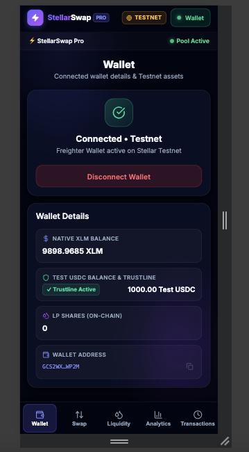
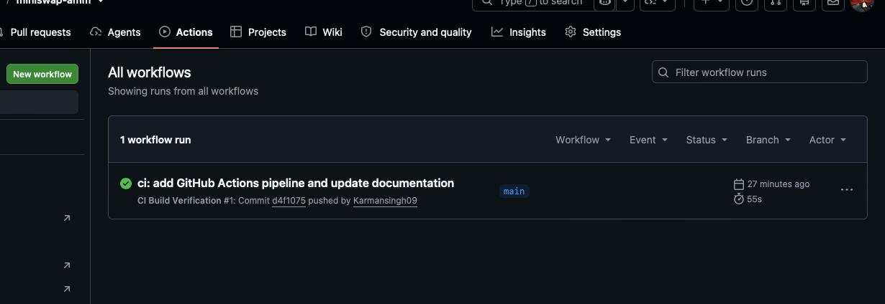
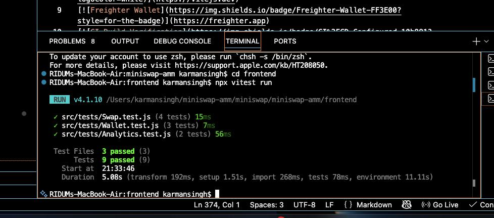

# MiniSwap AMM / StellarSwap Pro

> **A genuine, fully on-chain Decentralized Automated Market Maker (AMM) built on Stellar Testnet using Soroban smart contracts and Freighter wallet integration.**

[](https://stellar.org/soroban)
[](https://stellar.expert/explorer/testnet)
[](https://react.dev)
[](https://vitejs.dev)
[](https://freighter.app)
[](https://github.com/Karmansingh09/miniswap-amm/actions)

---

## 📌 Submission Quick Links

- **GitHub Repository**: [https://github.com/Karmansingh09/miniswap-amm](https://github.com/Karmansingh09/miniswap-amm)
- **Live Demo**: [https://miniswap-amm.vercel.app](https://miniswap-amm.vercel.app)
- **Demo Video (1–2 mins)**: [Watch Demo Video](https://drive.google.com/file/d/1YcN4Iav-r_YkqaLMlvXhgicrM48s3vbM/view?usp=sharing)
- **Deployed AMM Contract ID**: [`CAP7XKVIR32BF4RV2WLPTP5GMEFMFZYJMIP4MQHSW2NZJGKWRXMDKK3L`](https://stellar.expert/explorer/testnet/contract/CAP7XKVIR32BF4RV2WLPTP5GMEFMFZYJMIP4MQHSW2NZJGKWRXMDKK3L)
- **Stellar Expert Explorer**: [View AMM Contract on Stellar Expert](https://stellar.expert/explorer/testnet/contract/CAP7XKVIR32BF4RV2WLPTP5GMEFMFZYJMIP4MQHSW2NZJGKWRXMDKK3L)

---

## 🌟 Project Overview

**StellarSwap Pro** (MiniSwap AMM) is a non-custodial decentralized exchange (DEX) operating live on **Stellar Testnet**. The protocol uses a custom **Soroban Rust smart contract** implementing a constant-product ($x \cdot y = k$) pool mechanism with a 0.3% swap fee.

Unlike simulated demo DEXs, **every transaction in StellarSwap Pro is genuinely executed on-chain**:
- Token swaps, liquidity deposits, and withdrawals construct real Soroban contract call transactions.
- Transactions are signed explicitly by the user's **Freighter wallet extension**.
- Transaction hashes and ledger confirmations are fetched directly from **Stellar Testnet RPC** (`https://soroban-testnet.stellar.org`).
- Pool reserves and LP balances are read directly from Soroban RPC state.

---

## ✨ Key Features

1. **Native On-Chain Swaps**: Execute real swaps between Native XLM and project-issued Test USDC on Stellar Testnet.
2. **Constant-Product Liquidity Pools**: Deposit equal values of Native XLM and Test USDC to earn 0.3% fees on all pool swaps.
3. **Soroban LP Shares**: Mint and burn LP shares directly on-chain upon deposit/withdrawal.
4. **Freighter Wallet Integration**: Connect seamlessly via `@stellar/freighter-api` for secure, non-custodial transaction signing.
5. **1-Click Test USDC Trustline Setup**: Built-in ChangeTrust transaction builder for the exact project Test USDC asset (`USDC:GCX2VFJGK2IT5OWGQGDFZWDQRZAFUJSMLMI3HVIMGTZFMSJOFTGSGWQ3`).
6. **Native Mobile DeFi UI**: Fully responsive presentation optimized for screen sizes from 320px to 1024px+ with mobile bottom navigation, glassmorphism UI, and touch targets ($\ge 44\text{px}$).
7. **Real-Time On-Chain Analytics**: Inspect live pool reserves ($R_A, R_B$), exchange rates, and session transaction history with direct links to Stellar Expert Explorer.
8. **Responsive RPC Error Handling**: Soroban simulation errors collapse into friendly summaries with expandable technical details to prevent UI distortion.

---

## 🚀 Stellar Testnet Deployment Information

The AMM smart contract and its wrapped Stellar Asset Contracts (SACs) are deployed and initialized on **Stellar Testnet**.

| Parameter | Value / Verified Link |
|-----------|----------------------|
| **Network** | Stellar Testnet |
| **Network Passphrase** | `Test SDF Network ; September 2015` |
| **Soroban RPC URL** | `https://soroban-testnet.stellar.org` |
| **Horizon REST URL** | `https://horizon-testnet.stellar.org` |
| **AMM Contract ID** | [`CAP7XKVIR32BF4RV2WLPTP5GMEFMFZYJMIP4MQHSW2NZJGKWRXMDKK3L`](https://stellar.expert/explorer/testnet/contract/CAP7XKVIR32BF4RV2WLPTP5GMEFMFZYJMIP4MQHSW2NZJGKWRXMDKK3L) |
| **Token A (Native XLM SAC)** | [`CDLZFC3SYJYDZT7K67VZ75HPJVIEUVNIXF47ZG2FB2RMQQVU2HHGCYSC`](https://stellar.expert/explorer/testnet/contract/CDLZFC3SYJYDZT7K67VZ75HPJVIEUVNIXF47ZG2FB2RMQQVU2HHGCYSC) |
| **Token B (Test USDC SAC)** | [`CDO2QBWEPOA4HGJ4VMNC26MYRHHRIEK354X5TQQAYQTOKBFSKWMZUH77`](https://stellar.expert/explorer/testnet/contract/CDO2QBWEPOA4HGJ4VMNC26MYRHHRIEK354X5TQQAYQTOKBFSKWMZUH77) |
| **Test USDC Issuer Account** | `GCX2VFJGK2IT5OWGQGDFZWDQRZAFUJSMLMI3HVIMGTZFMSJOFTGSGWQ3` |
| **Contract Admin Account** | `GCX2VFJGK2IT5OWGQGDFZWDQRZAFUJSMLMI3HVIMGTZFMSJOFTGSGWQ3` |

---

## 🔗 Verified On-Chain Transactions

The following on-chain operations have been verified on **Stellar Testnet Explorer**:

| Operation | Verified Transaction Hash / Link |
|-----------|----------------------------------|
| **WASM Upload** | [`1e952073b19af9ebc5e8ec7ba48084b4c3c3601869cd52be4620365f8dde4591`](https://stellar.expert/explorer/testnet/tx/1e952073b19af9ebc5e8ec7ba48084b4c3c3601869cd52be4620365f8dde4591) |
| **Contract Deployment** | [`3b61d8e00847eab156d33b7736dcbbb42fcc3e7551bd48b6a26e89d1137f6964`](https://stellar.expert/explorer/testnet/tx/3b61d8e00847eab156d33b7736dcbbb42fcc3e7551bd48b6a26e89d1137f6964) |
| **Test USDC SAC Deployment** | [`58af4dcce8e8b8f1674e2d6595eb3cd190db612e436a424809911edde88e32b3`](https://stellar.expert/explorer/testnet/tx/58af4dcce8e8b8f1674e2d6595eb3cd190db612e436a424809911edde88e32b3) |
| **Contract Initialization** | [`e90910c605a73d38b9eb6ec23d90f4cdc20cf84f9d1d443d2aa8671c28f7283f`](https://stellar.expert/explorer/testnet/tx/e90910c605a73d38b9eb6ec23d90f4cdc20cf84f9d1d443d2aa8671c28f7283f) |
| **Test USDC Trustline Creation** | `TODO: Copy verified ChangeTrust transaction hash from Freighter wallet` |
| **Liquidity Deposit** | `TODO: Copy verified deposit transaction hash from Freighter wallet` |
| **Token Swap (XLM → Test USDC)** | `TODO: Copy verified swap transaction hash from Freighter wallet` |
| **Liquidity Withdrawal** | `TODO: Copy verified withdraw transaction hash from Freighter wallet` |

---

## 🏗️ Architecture & Project Structure

```text
miniswap-amm/
├── .github/
│   └── workflows/
│       └── build.yml               # CI Build Verification (Frontend + Soroban WASM)
├── Cargo.toml                      # Rust Workspace configuration
├── Cargo.lock
├── contracts/
│   └── amm/
│       ├── Cargo.toml              # Soroban Contract manifest (soroban-sdk 22.0.0)
│       └── src/
│           ├── lib.rs              # Soroban AMM contract logic (x*y=k)
│           └── test.rs             # Contract unit tests
├── frontend/                       # React + Vite Application
│   ├── package.json
│   ├── vite.config.js
│   └── src/
│       ├── config/
│       │   └── constants.js        # Contract ID & Network constants
│       ├── hooks/
│       │   └── useFreighter.js     # Freighter wallet integration hook
│       ├── services/
│       │   └── stellar.js          # Stellar SDK + Soroban RPC service
│       ├── utils/
│       │   └── helpers.js          # Formatting & mathematical helpers
│       ├── tests/                  # Vitest Unit Tests (9 passing)
│       │   ├── Swap.test.js
│       │   ├── Wallet.test.js
│       │   └── Analytics.test.js
│       ├── App.jsx                 # Main UI & Navigation
│       └── index.css               # Responsive Glassmorphism Styling
└── backend/                        # Optional off-chain utility backend
```

---

## 📐 How the Soroban AMM Works

The smart contract ([`contracts/amm/src/lib.rs`](file:///Users/karmansingh/miniswap-amm/miniswap/miniswap-amm/contracts/amm/src/lib.rs)) implements an automated market maker using the constant-product invariant:

$$x \cdot y = k$$

### Swap Formula (0.3% Fee)
For an exact input amount $dx$, the output amount $dy$ received is computed as:

$$dy = \frac{y \cdot (dx \cdot 997)}{x \cdot 1000 + (dx \cdot 997)}$$

Where:
- $x$ = Current reserve of input token
- $y$ = Current reserve of output token
- $dx$ = Input amount
- $997 / 1000$ = $0.3\%$ protocol fee deduction

### LP Share Minting
- **Initial Liquidity Deposit**: The initial LP shares minted equal the geometric mean of deposited amounts:
  $$\text{shares}_{\text{initial}} = \sqrt{\text{amount}_A \cdot \text{amount}_B}$$
- **Subsequent Liquidity Deposits**: LP shares are minted proportionally to the contribution to existing reserves:
  $$\text{shares} = \min\left(\frac{\text{amount}_A \cdot S}{R_A}, \frac{\text{amount}_B \cdot S}{R_B}\right)$$
  Where $S$ is total existing shares and $R_A, R_B$ are current reserves.

---

## ⚙️ Soroban Smart Contract Functions

| Function | Parameters | Description |
|----------|------------|-------------|
| `initialize` | `admin: Address`, `token_a: Address`, `token_b: Address` | Sets the pool admin and canonical token SAC addresses (can only be called once). |
| `deposit` | `to: Address`, `amount_a: i128`, `amount_b: i128`, `min_a: i128`, `min_b: i128` | Transfers token A and token B from user to pool and mints LP shares. |
| `swap` | `to: Address`, `buy_a: bool`, `out_amount: i128`, `max_in: i128` | Swaps token B for token A (if `buy_a=true`) or token A for token B (if `buy_a=false`). |
| `withdraw` | `to: Address`, `share_amount: i128`, `min_a: i128`, `min_b: i128` | Burns user LP shares and transfers proportional reserves back to user. |
| `get_reserves` | *None* | Read-only function returning `(i128, i128)` reserve tuple $(R_A, R_B)$. |
| `get_user_shares` | `user: Address` | Read-only function returning user LP share balance. |
| `get_total_shares` | *None* | Read-only function returning total pool LP share supply. |

---

## 🔌 Freighter Wallet & Transaction Flow

```text
[ User Interface ]
       │
       ▼ (1. Click Swap / Add Liquidity / Trustline)
[ src/services/stellar.js ]
       │  • Builds Transaction & Operation
       │  • Calls server.simulateTransaction() -> fetches footprint & auth
       │  • Assembles transaction with Soroban resources
       ▼
[ @stellar/freighter-api ]
       │  • Prompts Freighter Wallet Extension (User approves XDR)
       ▼
[ Stellar Testnet RPC ] (https://soroban-testnet.stellar.org)
       │  • Submits signed transaction (sendTransaction)
       │  • Polls getTransaction until confirmed
       ▼
[ UI Update ] -> Display Real 64-char Hash + Stellar Expert Link
```

---

## 💻 Tech Stack

- **Smart Contracts**: Rust, Soroban SDK (`soroban-sdk = 22.0.0`)
- **Smart Contract Target**: `wasm32v1-none`
- **Frontend**: React 19, Vite 8, JavaScript (ESM)
- **Stellar Libraries**: `@stellar/stellar-sdk` (v16.2.0), `@stellar/freighter-api` (v6.0.1)
- **Styling**: Modern Vanilla CSS, Glassmorphism, Framer Motion
- **Icons**: Lucide React
- **Test Runner**: Vitest 4
- **CLI Tools**: Stellar CLI (`27.0.0`)

---

## 🚀 Running the Application Locally

### Prerequisites
- Node.js v18+ and npm
- Freighter Wallet Browser Extension (set to **Testnet**)

### 1. Clone the Repository
```bash
git clone https://github.com/Karmansingh09/miniswap-amm.git
cd miniswap-amm/frontend
```

### 2. Install Dependencies
```bash
npm install
```

### 3. Start Development Server
```bash
npm run dev
```
Navigate to `http://localhost:5173`.

---

## 🔐 Establishing Test USDC Trustline

The application requires a trustline for our specific project Test USDC asset (`USDC:GCX2VFJGK2IT5OWGQGDFZWDQRZAFUJSMLMI3HVIMGTZFMSJOFTGSGWQ3`).

### Method 1: Via Frontend (Recommended)
1. Connect your Freighter wallet on `http://localhost:5173`.
2. Go to the **Wallet** tab.
3. Click **"Establish Exact Test USDC Trustline"**.
4. Approve the `ChangeTrust` transaction in the Freighter popup.

### Method 2: Via Stellar CLI
```bash
stellar keys change-trust \
  --source <YOUR_FREIGHTER_PUBLIC_KEY> \
  --line USDC:GCX2VFJGK2IT5OWGQGDFZWDQRZAFUJSMLMI3HVIMGTZFMSJOFTGSGWQ3 \
  --network testnet
```

---

## 🧪 Build & Test Instructions

### Run Unit Tests
The project includes a 9-test Vitest suite verifying swap outputs, fee calculations, address shortening, and currency formatting:

```bash
cd frontend
npx vitest run
```

**Test Output**:
```text
 RUN  v4.1.10 /frontend

 ✓ src/tests/Swap.test.js (4 tests)
 ✓ src/tests/Wallet.test.js (3 tests)
 ✓ src/tests/Analytics.test.js (2 tests)

 Test Files  3 passed (3)
      Tests  9 passed (9)
```

### Build Production Bundle
```bash
cd frontend
npm run build
```

---

## 🔄 Optional: Deploying Your Own Soroban AMM

> **Note**: The repository is already configured with a live deployed contract (`CAP7XKVIR32BF4RV2WLPTP5GMEFMFZYJMIP4MQHSW2NZJGKWRXMDKK3L`). You only need these steps if you want to deploy a fresh instance.

### 1. Compile Smart Contract to WASM
```bash
cargo build --release --target wasm32v1-none
```

### 2. Generate and Fund Deployer Account
```bash
stellar keys generate deployer --network testnet
stellar keys fund deployer --network testnet
```

### 3. Deploy Contract
```bash
stellar contract deploy \
  --wasm target/wasm32v1-none/release/soroban_amm.wasm \
  --source deployer \
  --network testnet
```

### 4. Deploy Test USDC Asset Contract
```bash
stellar contract asset deploy \
  --asset USDC:GCX2VFJGK2IT5OWGQGDFZWDQRZAFUJSMLMI3HVIMGTZFMSJOFTGSGWQ3 \
  --source deployer \
  --network testnet
```

### 5. Initialize Contract
```bash
stellar contract invoke \
  --id <YOUR_CONTRACT_ID> \
  --source deployer \
  --network testnet \
  -- initialize \
  --admin <DEPLOYER_PUBLIC_KEY> \
  --token_a CDLZFC3SYJYDZT7K67VZ75HPJVIEUVNIXF47ZG2FB2RMQQVU2HHGCYSC \
  --token_b <YOUR_TEST_USDC_SAC_ID>
```

---

## ⚙️ CI/CD Pipeline

Continuous Integration is configured via GitHub Actions ([`.github/workflows/build.yml`](.github/workflows/build.yml)) with triggers on `push` to `main`, `pull_request` to `main`, and `workflow_dispatch`:
- **Build & Test Frontend Job**: Sets up Node.js 20, caches npm dependencies (`cache-dependency-path: frontend/package-lock.json`), executes `npm ci`, runs 9 Vitest unit tests (`npx vitest run`), and compiles the Vite production bundle (`npm run build`).
- **Build Soroban Contract Job**: Sets up Rust stable toolchain with `wasm32v1-none` target, caches Cargo dependencies, compiles the Soroban AMM contract (`cargo build --release --target wasm32v1-none`), and verifies the output WASM binary (`target/wasm32v1-none/release/soroban_amm.wasm`).

---

## 📱 Mobile Responsiveness

StellarSwap Pro features a mobile-native presentation designed specifically for screens between **320px** and **768px**:
- **Compact Mobile Header**: Shows project branding, `TESTNET` badge, and compact wallet status without header overflow.
- **Fixed Glass Bottom Navigation**: Fixed 64px bottom bar with safe-area inset support (`env(safe-area-inset-bottom)`).
- **Collapsible Soroban Errors**: Long RPC simulation errors collapse into user-friendly summaries with expandable technical details.
- **Touch UX**: Interactive elements have minimum $44\text{px}$ touch targets.
- **Card-Based Mobile Transactions**: Auto-converts horizontal transaction tables into responsive cards.

---

## 🖼️ Screenshots

### 📱 Mobile Responsive UI

Responsive mobile interface with Freighter wallet connection, Stellar Testnet assets, and mobile navigation.



### ⚙️ CI/CD Pipeline

GitHub Actions CI pipeline successfully completed for the project.



### 🧪 Test Suite — 9/9 Passed

Frontend unit tests covering Swap, Wallet, and Analytics functionality.



---

## 🎥 Demo Video

A short demonstration of StellarSwap Pro running live on Stellar Testnet, including Freighter wallet integration, liquidity, swaps, analytics, and on-chain transactions.

▶️ [Watch the StellarSwap Pro Demo Video](https://drive.google.com/file/d/1YcN4Iav-r_YkqaLMlvXhgicrM48s3vbM/view?usp=sharing)

---

## 🔒 Security & Non-Custodial Safeguards

- **No Secret Key Storage**: The application never prompts for, receives, or stores private keys or seed phrases.
- **Client-Side Signing**: All transaction payloads are passed as XDR to the official Freighter extension for explicit user approval.
- **Slippage Limits**: Swap and liquidity functions enforce minimum output and maximum input limits ($max\_in$, $min\_out$) directly inside the Soroban contract.

---

## ⚠️ Testnet Disclaimer & Known Limitations

- **Stellar Testnet Only**: This application operates strictly on Stellar Testnet using test XLM and project-issued Test USDC.
- **Test USDC**: The Test USDC used in this deployment is a custom Testnet asset issued by `GCX2VFJGK2IT5OWGQGDFZWDQRZAFUJSMLMI3HVIMGTZFMSJOFTGSGWQ3`. It is not official Circle production USDC.
- **Testnet Resets**: Stellar Testnet ledger data may be reset periodically by the Stellar Development Foundation (SDF).

---

## 📄 License

This project is licensed under the MIT License — see the [LICENSE](LICENSE) file for details.
