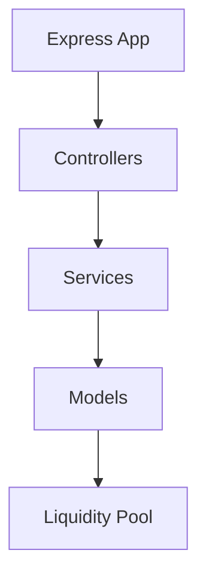
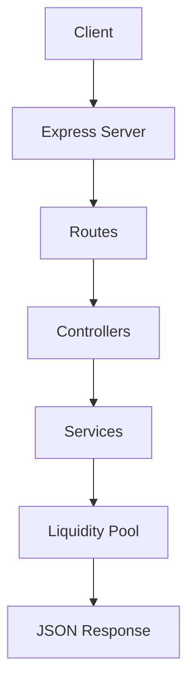

# MiniSwap AMM

<p align="center">
	
	
	
	
</p>

<p align="center">
	<strong>A decentralized exchange simulator inspired by Uniswap.</strong><br />
	A polished Node.js + Express backend for automated market maker pricing, liquidity management, and REST API experimentation.
</p>

<p align="center">
	
	
	
</p>

---

## Table of Contents

- [Project Overview](#project-overview)
- [Features](#features)
- [Architecture](#architecture)
- [Request Flow](#request-flow)
- [Folder Structure](#folder-structure)
- [Constant Product Formula](#constant-product-formula)
- [API Reference](#api-reference)
- [Example API Requests](#example-api-requests)
- [Example API Responses](#example-api-responses)
- [Installation Guide](#installation-guide)
- [Running Locally](#running-locally)
- [Technologies Used](#technologies-used)
- [Future Improvements](#future-improvements)
- [Contributing](#contributing)
- [License](#license)
- [Footer](#footer)

---

## Project Overview

MiniSwap AMM is a compact automated market maker backend that simulates the core behavior of a decentralized exchange.

It provides REST endpoints for pricing, trading, and liquidity management using a singleton liquidity pool held entirely in memory.

This makes the project ideal for:

- learning how AMMs work
- testing pricing logic without blockchain complexity
- demonstrating layered backend architecture
- prototyping DEX-style APIs quickly

<details>
<summary><strong>What this backend demonstrates</strong></summary>

- request routing with Express
- controller-driven HTTP handling
- service-based business logic
- model-level shared state management
- constant product AMM math

</details>

---

## Features

- ✅ Health API for uptime checks
- ✅ Quote API for buy-side pricing simulation
- ✅ Buy Asset endpoint that updates pool state
- ✅ Sell Asset endpoint that updates pool state
- ✅ Add Liquidity endpoint with LP token minting
- ✅ Remove Liquidity endpoint with proportional withdrawals
- ✅ Constant product AMM pricing model
- ✅ Clean layered architecture
- ✅ JSON-based REST responses
- ✅ Simple, readable code structure

<details>
<summary><strong>Feature highlights</strong></summary>

The project covers the full lifecycle of a basic liquidity pool:

1. Traders can request quotes before executing swaps.
2. Liquidity providers can deposit tokens and mint LP supply.
3. LP holders can burn liquidity shares and withdraw assets proportionally.
4. The pool state changes in memory with each successful trade.

</details>

---

## Architecture



### Layer Breakdown

| Layer | Responsibility |
|---|---|
| Express App | Mounts middleware and routes |
| Controllers | Parse requests and return HTTP responses |
| Services | Implement AMM logic and state transitions |
| Models | Store shared data structures |
| Liquidity Pool | Holds reserves and LP token supply |

<details>
<summary><strong>Why this structure works well</strong></summary>

This layout keeps the codebase easy to reason about:

- routes stay thin
- controllers stay focused on HTTP concerns
- services own the AMM math
- models keep the pool state centralized

</details>

---

## Request Flow



---

## Folder Structure

```text
backend/
├── package.json
├── server.js
├── test.js
└── src/
		├── app.js
		├── controllers/
		│   └── ammController.js
		├── models/
		│   └── liquidityPool.js
		├── routes/
		│   └── ammRoutes.js
		└── services/
				└── ammService.js
```

---

## Constant Product Formula

MiniSwap uses the classic AMM rule:

$$
x \cdot y = k
$$

Where:

- $x$ = asset reserve
- $y$ = USDC reserve
- $k$ = constant product

### Buy Asset

When a user buys asset tokens from the pool:

- asset reserve goes down
- USDC reserve goes up
- price increases as liquidity is removed

### Sell Asset

When a user sells asset tokens into the pool:

- asset reserve goes up
- USDC reserve goes down
- price decreases as assets are added

### Add Liquidity

When liquidity is added:

- both reserves increase
- LP tokens are minted based on the provider's share

### Remove Liquidity

When liquidity is removed:

- both reserves decrease proportionally
- LP tokens are burned
- the provider receives their share of the pool

<details>
<summary><strong>Core formulas</strong></summary>

- **Buy quote**
	- `newAssetReserve = assetReserve - assetAmount`
	- `newUsdcReserve = k / newAssetReserve`
	- `usdcRequired = newUsdcReserve - usdcReserve`

- **Sell quote**
	- `newAssetReserve = assetReserve + assetAmount`
	- `newUsdcReserve = k / newAssetReserve`
	- `usdcReceived = usdcReserve - newUsdcReserve`

- **Add liquidity**
	- `lpTokensMinted = (assetAmount / previousAssetReserve) * previousLpTokenSupply`

- **Remove liquidity**
	- `share = lpTokens / lpTokenSupply`
	- `assetReturned = assetReserve * share`
	- `usdcReturned = usdcReserve * share`

</details>

---

## API Reference

| Method | Endpoint | Description | Request Body |
|---|---|---|---|
| GET | `/api/health` | Returns service health status | None |
| POST | `/api/quote` | Returns a buy quote without changing pool state | `{ "assetAmount": 100 }` |
| POST | `/api/buy-asset` | Buys assets and updates the pool | `{ "assetAmount": 100 }` |
| POST | `/api/sell-asset` | Sells assets and updates the pool | `{ "assetAmount": 100 }` |
| POST | `/api/add-liquidity` | Adds liquidity and mints LP tokens | `{ "assetAmount": 100, "usdcAmount": 20000 }` |
| POST | `/api/remove-liquidity` | Removes liquidity and burns LP tokens | `{ "lpTokens": 50 }` |

### API Notes

- All responses are JSON.
- Validation errors return HTTP `400`.
- Successful mutation endpoints return the updated pool state.
- The pool is stored as a singleton in memory, so values persist while the server process is running.

---

## Example API Requests

### Health Check

```bash
curl http://localhost:5000/api/health
```

### Get a Buy Quote

```bash
curl -X POST http://localhost:5000/api/quote \
	-H "Content-Type: application/json" \
	-d '{"assetAmount":100}'
```

### Buy Asset

```bash
curl -X POST http://localhost:5000/api/buy-asset \
	-H "Content-Type: application/json" \
	-d '{"assetAmount":100}'
```

### Sell Asset

```bash
curl -X POST http://localhost:5000/api/sell-asset \
	-H "Content-Type: application/json" \
	-d '{"assetAmount":100}'
```

### Add Liquidity

```bash
curl -X POST http://localhost:5000/api/add-liquidity \
	-H "Content-Type: application/json" \
	-d '{"assetAmount":100,"usdcAmount":20000}'
```

### Remove Liquidity

```bash
curl -X POST http://localhost:5000/api/remove-liquidity \
	-H "Content-Type: application/json" \
	-d '{"lpTokens":50}'
```

---

## Example API Responses

<details>
<summary><strong>GET /api/health</strong></summary>

```json
{
	"success": true,
	"message": "MiniSwap API is running 🚀"
}
```

</details>

<details>
<summary><strong>POST /api/quote</strong></summary>

```json
{
	"success": true,
	"data": {
		"assetAmount": 100,
		"usdcRequired": 22222.22222222222,
		"newAssetReserve": 900,
		"newUsdcReserve": 222222.22222222222,
		"priceImpact": 11.1111111111111
	}
}
```

</details>

<details>
<summary><strong>POST /api/buy-asset</strong></summary>

```json
{
	"success": true,
	"data": {
		"assetAmount": 100,
		"usdcRequired": 22222.22222222222,
		"newAssetReserve": 900,
		"newUsdcReserve": 222222.22222222222,
		"priceImpact": 11.1111111111111,
		"updatedPool": {
			"assetReserve": 900,
			"usdcReserve": 222222.22222222222,
			"lpTokenSupply": 1000
		}
	}
}
```

</details>

<details>
<summary><strong>POST /api/add-liquidity</strong></summary>

```json
{
	"success": true,
	"data": {
		"assetAmount": 100,
		"usdcAmount": 20000,
		"lpTokensMinted": 100,
		"updatedPool": {
			"assetReserve": 1100,
			"usdcReserve": 220000,
			"lpTokenSupply": 1100
		}
	}
}
```

</details>

<details>
<summary><strong>POST /api/remove-liquidity</strong></summary>

```json
{
	"success": true,
	"data": {
		"lpTokensBurned": 50,
		"assetReturned": 50,
		"usdcReturned": 10000,
		"updatedPool": {
			"assetReserve": 1050,
			"usdcReserve": 210000,
			"lpTokenSupply": 1050
		}
	}
}
```

</details>

---

## Installation Guide

### 1. Clone the repository

```bash
git clone <your-repo-url>
cd miniswap-amm/backend
```

### 2. Install dependencies

```bash
npm install
```

### 3. Configure environment variables

Create a `.env` file in the backend directory if needed:

```env
PORT=5000
```

---

## Running Locally

### Development mode

```bash
npm run dev
```

### Production mode

```bash
npm start
```

### Run the manual test script

```bash
npm test
```

The API will be available at:

```text
http://localhost:5000
```

---

## Technologies Used

- Node.js
- Express
- JavaScript
- dotenv
- cors
- nodemon

---

## Future Improvements

- Add persistent database storage for pool state
- Add authentication and role-based access control
- Add TypeScript for stronger type safety
- Add automated API tests with a test runner
- Add transaction history and pool analytics
- Add frontend integration with live pool visualization
- Add slippage controls and price impact warnings
- Add multi-pool support

---

## Contributing

Contributions are welcome.

1. Fork the repository.
2. Create a feature branch.
3. Make your changes.
4. Run the backend locally and verify behavior.
5. Open a pull request.

### Suggested contribution standards

- Keep changes focused and minimal.
- Follow the existing service/controller/router structure.
- Add validation for new endpoints.
- Update the README when new user-facing behavior is introduced.

---

## License

This project is licensed under the MIT License. See the `LICENSE` file if present, or add one if you intend to distribute the project publicly.

---

## Footer

<p align="center">
	Crafted and maintained by Karman Singh Chandhok
</p>
